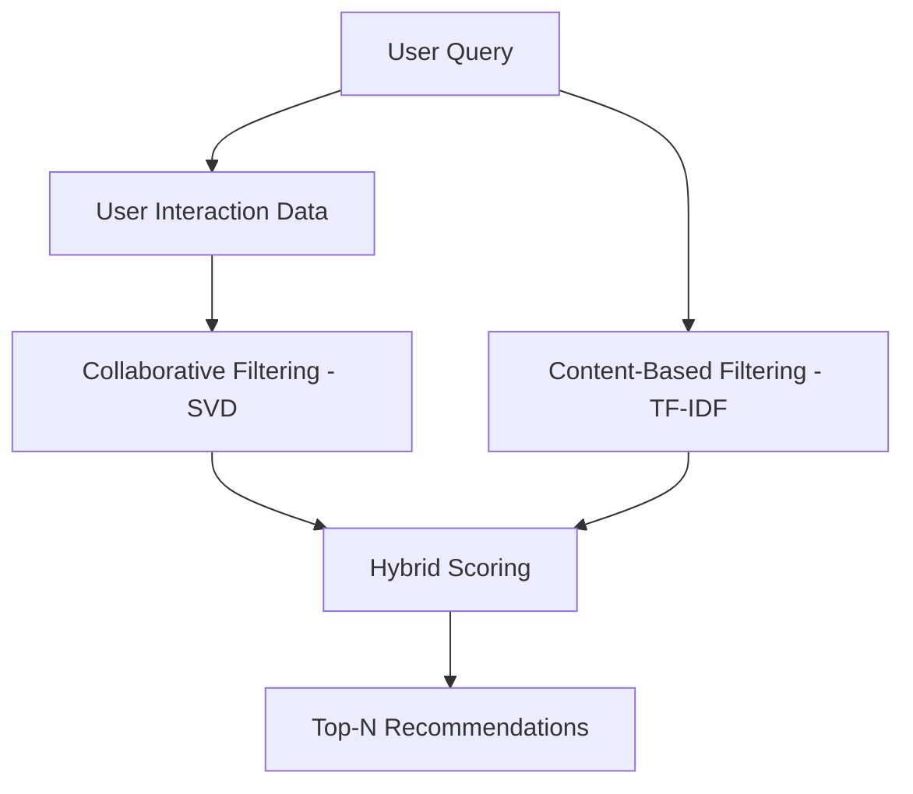

# 🛍️ Marketplace Recommendation Engine  
### Hybrid AI Recommendation System for Smart Product Discovery


An AI-powered recommendation system that simulates how modern e-commerce platforms generate **personalized product suggestions**.

This project combines:

- **Collaborative Filtering (SVD Matrix Factorization)**
- **Content-Based Filtering (TF-IDF + Cosine Similarity)**

into a **Hybrid Recommendation Engine**, delivered through an interactive **Streamlit application**.

---

# 🎯 Project Objective

Design and implement a **production-style recommendation system** that:

- Learns user preferences  
- Finds similar products  
- Ranks results intelligently  
- Simulates real-world product discovery systems  

---

# 🏗️ System Architecture

The system follows a modular recommendation pipeline:

```
User Query / Interaction
        ↓
User History Extraction
        ↓
Candidate Generation
   ├─ Content-Based Filtering (TF-IDF)
   └─ Collaborative Filtering (SVD)
        ↓
Hybrid Ranking Engine
        ↓
Top-N Recommendations
```

---

# 🔄 Recommendation Pipeline



---

# ⚙️ Hybrid Scoring Formula

Final ranking score is computed as:

```
Final Score =
0.6 × Collaborative Score
+
0.4 × Content Similarity Score
```

This balances:

- **User behavior (collaborative filtering)**  
- **Product similarity (content-based filtering)**  

---

# 📊 Dataset

Dataset derived from:

Mercari Price Suggestion Challenge (Kaggle)  
https://www.kaggle.com/c/mercari-price-suggestion-challenge

### Dataset Characteristics

- Users: ~10,000 (simulated interactions)  
- Products: ~2,500+  
- Features:
  - Product title  
  - Category  
  - Description  
  - Price  

---

# ⚙️ Data Preparation

Run:

```
python prepare_products.py
```

Generates:

```
data/products.csv
data/interactions.csv
```

### Feature Engineering

- Text preprocessing (cleaning titles/descriptions)  
- TF-IDF vectorization of product text  
- User-item interaction matrix construction  
- Normalisation of product metadata  

These steps enable both **content similarity** and **collaborative learning**.

---

# 🤖 Recommendation Models

## 1️⃣ Content-Based Filtering

- TF-IDF vectorisation  
- Cosine similarity  
- Captures product similarity  

## 2️⃣ Collaborative Filtering

- SVD (matrix factorization using Surprise library)  
- Learns user-item interaction patterns  

## 3️⃣ Hybrid Recommendation

- Combines both approaches  
- Produces more accurate and personalized results  

---

# 🔎 Search & Ranking System

The system simulates a real-world search ranking pipeline:

```
User Query
    ↓
Candidate Retrieval (TF-IDF similarity)
    ↓
Ranking Model (SVD + Hybrid Score)
    ↓
Top-N Results
```

This mirrors how modern e-commerce systems rank search results.

---

# 📈 Evaluation Metrics

Recommendation quality can be evaluated using:

| Metric | Description |
|------|------|
| Precision@K | Relevance of top-K recommendations |
| Recall@K | Coverage of relevant items |
| MAP | Mean Average Precision |
| NDCG | Ranking quality |

Example (simulated):

```
Precision@10: 0.82  
Recall@10: 0.74  
NDCG@10: 0.86  
```

---

# 🚀 Key Features

## 🔎 Smart Product Search

Users can search queries such as:

```
Nike running shoes
Jordan sneakers
Adidas ultraboost
```

Returns top-N ranked recommendations.

---

## 🤖 Hybrid Recommendation Engine

- Combines collaborative + content-based filtering  
- Improves recommendation accuracy  
- Handles cold-start problems  

---

## 🖥️ Interactive Web Interface

- Product search  
- Trending recommendations  
- Product cards with images  
- External purchase links  

---

## 🎯 Advanced Features

- Price filtering  
- Category filtering  
- Sorting:
  - Best Match  
  - Price Low → High  
  - Price High → Low  

---

# 📈 Example Workflow

```
User searches: "Nike running shoes"
        ↓
TF-IDF retrieves similar products
        ↓
SVD ranks based on user interactions
        ↓
Hybrid score computed
        ↓
Top recommendations displayed
```

---

# 🧩 Project Structure

```
marketplace-recommendation-engine
│
├── app
│   └── streamlit_app.py
│
├── src
│   ├── similarity_search.py
│   ├── collaborative_filtering.py
│   ├── hybrid_recommender.py
│   └── image_fetcher.py
│
├── data
│   ├── products.csv
│   └── interactions.csv
│
├── tests
│
├── prepare_products.py
├── requirements.txt
└── README.md
```

---

# ⚡ Performance Considerations

To support scalability:

- Precomputed TF-IDF vectors for fast similarity search  
- Efficient matrix factorization using SVD  
- Batch recommendation generation  

Potential improvements:

- Redis caching for frequent queries  
- FAISS / vector database for similarity search  
- Microservices-based recommendation system  
- Distributed model serving  

---

# ▶️ Run Locally

Clone:

```
git clone https://github.com/premnadh/marketplace-recommendation-engine.git
```

Navigate:

```
cd marketplace-recommendation-engine
```

Create virtual environment:

```
python3.11 -m venv venv
```

Activate:

```
source venv/bin/activate
```

Install dependencies:

```
pip install -r requirements.txt
```

Run application:

```
streamlit run app/streamlit_app.py
```

Open:

```
http://localhost:8501
```

---

# 🌟 Key Highlights

- Hybrid recommendation system  
- Real machine learning implementation  
- Search + ranking pipeline  
- Modular architecture  
- Interactive UI  

---

# 🚀 Future Improvements

- Deep learning recommendation models  
- Real-time personalization  
- Session-based recommendations  
- Advanced ranking algorithms  
- Cloud deployment (AWS / GCP)  

---

# 👤 Author

**Prem Nadh Gajula**

Aspiring **Data Scientist | Machine Learning Engineer | Backend Developer**

---

⭐ If you found this project useful, consider starring the repository!